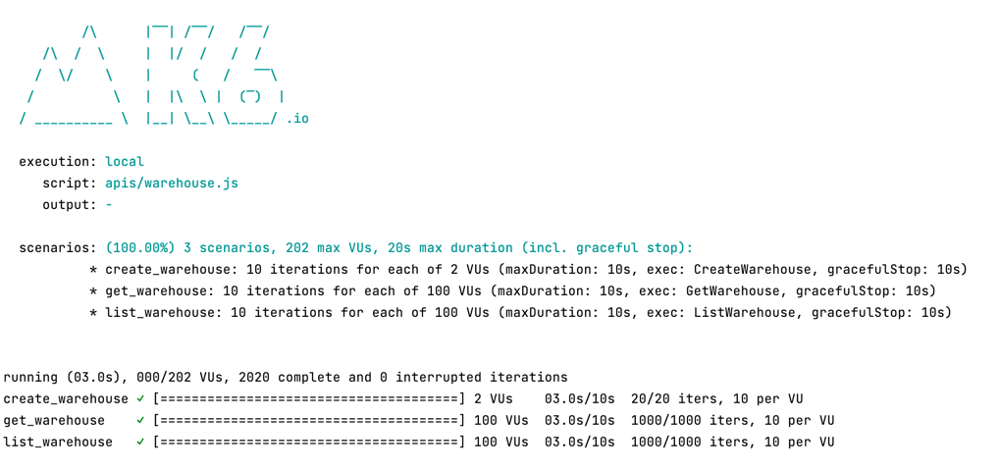
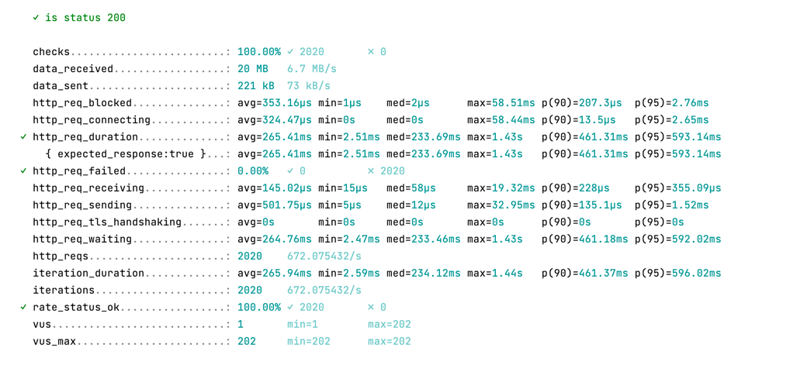

## K6 FOR LOAD TESTS

### 1. Introduction

**Grafana K6** is an open-source load testing tool that makes performance testing easy and productive for engineering
teams. K6 is free, developer-centric, and extensible.

Using K6, you can test the reliability and performance of your systems and catch performance regressions and problems
earlier. K6 will help you to build resilient and performant applications that scale.

Use cases:

- Load testing: K6 is optimized for minimal resource consumption and designed for running high load tests (spike,
  stress, soak tests).
- Performance and synthetic monitoring: With K6, you could run tests with a small amount of load to continuously
  validate the performance and availability of your production environment.
- Chaos and reliability testing: K6 provides an extensible architecture. You can use K6 to simulate traffic as part of
  your chaos experiments or trigger them from your K6 tests.

### 2. Documents

- K6 document: https://k6.io/docs

### 3. Notes

- There are many executors, please choose what you want and put them into your scenarios with some required attributes:
    - **shared-iterations**: A fixed amount of iterations is "shared" between a number of VUs. If you use this, please
      set up `vus, iterations & maxDuration`.
    - **per-vu-iterations**: Each VU executes an exact number of iterations. If you use this, please set
      up `vus, iterations & maxDuration`.
    - **constant-vus**: A fixed number of VUs execute as many iterations as possible for a specified amount of time. If
      you use this, please set up `duration`. Note that, `(iteration) duration` is the time from start to finish of the
      VU's `exec` function.
    - **externally-controlled**: Control and scale execution at runtime via k6's REST API or the CLI. The required param
      is `duration`.
    - **constant-arrival-rate**: A fixed number of iterations are executed in a specified period of time. The required
      params are `duration, rate & preAllocatedVUs`. Note that, `rate=X & timeUnit=Y` means X iterations per Y time. For
      example, rate = 90 & timeUnit = '1m' means 90 iterations per one minute.
    - Other executors you can find here: [K6 Scenarios](https://k6.io/docs/using-k6/scenarios)

- How about **gracefulStop** in scenarios?. This option is available for all executors except `externally-controlled`
  and allows the user to specify a duration to wait before forcefully interrupting them. The default value of this
  property is 30s.

- To understand the **arrival rate** word clearer in closed model (constant-vus executor) and opened model (
  constant-arrival-rate or ramping-arrival-rate executors), please
  see [this document](https://k6.io/docs/using-k6/scenarios/arrival-rate/).

### 4. Results

